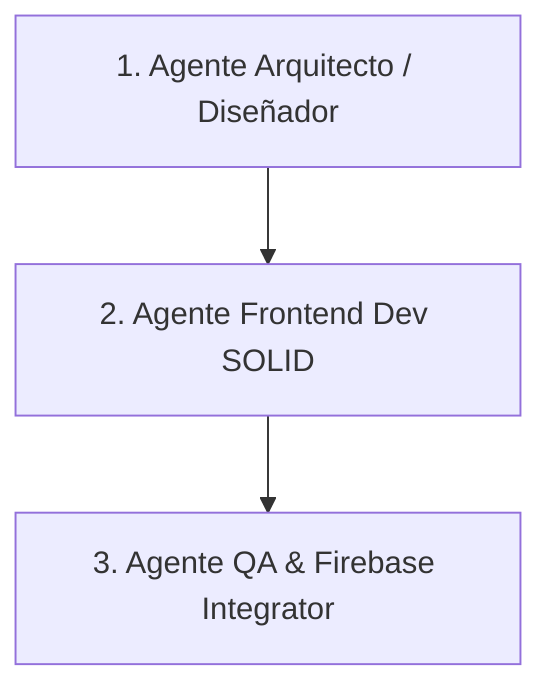

# Guía de Agentes y Colaboración (AGENTS.md)

Este documento define los roles, responsabilidades y pautas operativas para los agentes de IA (y desarrolladores humanos) que participen en la construcción de la web-app **Prode Mundial 2026**. Su objetivo es mantener la consistencia del código, respetar los principios SOLID y garantizar que cada componente se desarrolle con el máximo rigor técnico.

---

## 1. Roles de Agentes Definidos

Para este proyecto, estructuramos las tareas bajo tres perfiles especializados. Al asumir una tarea, asegurate de actuar bajo el rol correspondiente:



### 1. Agente Arquitecto / Diseñador (Rol de Antigravity Principal)
- **Responsabilidad**: Diseñar las abstracciones, estructuras de datos en Firestore, interfaces (TypeScript) y resguardar que se cumpla el desacoplamiento.
- **Enfoque**: SOLID, Clean Architecture, patrones de diseño.
- **Entregables**: Diagramas, modelos de datos, definición de firmas de funciones y hooks.

### 2. Agente Frontend Dev (SOLID & Presentational)
- **Responsabilidad**: Construir la interfaz de usuario basándose en los tokens definidos en `DESIGN.md`.
- **Enfoque**:
  - **Componentes Dumb (Presentational)**: Reciben datos por props, emiten eventos por callbacks. No conocen Firebase ni manejan estado complejo.
  - **Componentes Smart (Containers)**: Manejan suscripciones a datos, estados de carga (loading, error) y delegan la renderización a los presentational.
  - **CSS Puro**: Diseños fluidos, flexbox/grid, transiciones premium, sin layouts genéricos ni frameworks intrusivos a menos que se acuerde.

### 3. Agente QA & Firebase Integrator
- **Responsabilidad**: Implementar servicios de Firebase, escribir reglas de seguridad de Firestore (`firestore.rules`), asegurar el flujo de la whitelist privada y realizar validaciones técnicas.
- **Enfoque**: Seguridad (least privilege), consistencia eventual de rankings, pruebas de integración.

---

## 2. Convenciones de Código y Estructura

Para evitar desorden en la base de código, respetaremos estrictamente la siguiente estructura de directorios:

```text
src/
├── assets/          # Imágenes, iconos y recursos estáticos
├── components/      # Componentes Presentational (Dumb)
│   ├── common/      # Botones, inputs, modales, cards reutilizables
│   └── prode/       # Fichas de partidos, formularios de predicción
├── containers/      # Componentes Container (Smart)
│   ├── LoginContainer.tsx
│   ├── ProdeFormContainer.tsx
│   └── LeaderboardContainer.tsx
├── contexts/        # Contextos globales (AuthContext, ThemeContext)
├── hooks/           # Custom Hooks para modularizar lógica
│   ├── useAuth.ts
│   ├── useProde.ts
│   └── useMatches.ts
├── services/        # Capa de infraestructura (Firebase API, mock data)
│   ├── firebase.ts
│   └── db.ts
├── types/           # Interfaces y tipos TypeScript globales
│   └── index.ts
└── index.css        # Variables CSS HSL, reset y clases globales
```

---

## 3. Flujo de Trabajo para Tareas (Paso a Paso)

Cada vez que un agente comience una tarea del Roadmap, debe seguir este protocolo:

1. **Entender el Contexto**: Leer `DESIGN.md` para aplicar los tokens visuales exactos y la interfaz correcta.
2. **Definir la Interfaz**: Antes de programar lógica, escribir las interfaces de TypeScript en `src/types/index.ts`.
3. **Separar Container de Presentational**:
   - Crear el componente visual en `src/components/` (debe ser puro y fácilmente testeable visualmente).
   - Crear el contenedor en `src/containers/` que conecta ese componente con su hook/contexto.
4. **Validación de Reglas de Firebase**: Si la tarea involucra Firestore, asegurar que las lecturas y escrituras se validen contra las reglas de seguridad correspondientes (ej. que solo los administradores puedan escribir en `whitelist` y `matches`).
5. **Reportar Avances**: Actualizar el Roadmap general marcando el progreso.
